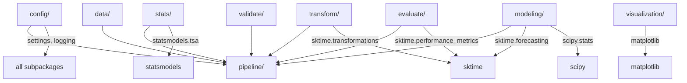

# 🎯 Architecture

> [!NOTE]
> Component mapping and data flow architecture for `multi-time` and its `sktime` layer. For state variables, ensure compliance with [Notation and Glossary](technical/notation.md).



## Subpackage Descriptions

| Subpackage | Files | Purpose | Key Dependencies |
| --- | --- | --- | --- |
| `config/` | `settings.py`, `logging.py` | YAML/dict configuration, structured logging | `pyyaml`, stdlib `logging` |
| `data/` | `loaders.py`, `generators.py` (facade), `generators_core.py`, `generators_specialty.py` | CSV I/O, 10 sample data generators, registry | `pandas`, `numpy` |
| `validate/` | `validators.py` (facade), `validation.py`, `frequency.py`, `patchiness.py`, `harmonize.py` | Series validation, freq detection, gap analysis, harmonization | `pandas`, `numpy` |
| `stats/` | `tests.py` (facade), `descriptive.py`, `result.py`, `stationarity.py`, `normality.py`, `seasonality.py`, `causality.py` | Descriptive stats + 5 statistical tests (ADF, KPSS, Shapiro, ARCH, Granger) | `statsmodels`, `scipy` |
| `transform/` | `transformers.py` | 6 sktime transformer wrappers + pipeline builder | `sktime.transformations` |
| `modeling/` | `forecasters.py` (facade), `registry.py`, `ensemble.py`, `evaluation.py`, `probabilistic.py` | 6 forecaster factories, ensemble, tuning, probabilistic | `sktime.forecasting`, `scipy` |
| `evaluate/` | `metrics.py` | 6 forecast evaluation metrics registry | `sktime.performance_metrics` |
| `visualization/` | `plots.py` (facade), `core.py`, `series.py`, `forecast.py`, `diagnostics.py`, `statistics.py`, `comparison.py` | 19 plot functions across 6 categories | `matplotlib`, `scipy` |
| `pipeline/` | `__init__.py` | End-to-end configurable pipeline (6 stages) | all above |

## File Counts

| Category | Count |
| --- | --- |
| Python source files | 42 |
| Test files | 180 tests across 9 test modules |
| CLI scripts | 8 (7 task-specific + 1 master `run_all.py`) |

## Data Flow

```text
Input CSV / Series
    │
    ▼
┌──────────┐    ┌──────────┐    ┌──────────┐
│ VALIDATE │───▶│ DESCRIBE │───▶│   TEST   │
└──────────┘    └──────────┘    └──────────┘
                                     │
                                     ▼
                                ┌──────────┐    ┌──────────┐    ┌──────────┐
                                │TRANSFORM │───▶│ FORECAST │───▶│ EVALUATE │
                                └──────────┘    └──────────┘    └──────────┘
                                                                     │
                                                                     ▼
                                                              PipelineResult
                                                           (JSON → output/)
```

## Design Principles

1. **Modular** — Each subpackage is independently importable and testable; large files split into focused sub-modules with facade re-exports
2. **Configurable** — All behavior driven by `MultiTimeConfig` dataclass
3. **Logged** — Every operation logs via structured module-level loggers
4. **Validated** — Input validation at every entry point
5. **Thin Orchestrators** — Scripts in `scripts/` are CLI wrappers, zero business logic
6. **Graceful Fallbacks** — Optional dependencies handled via `try-except`
7. **Registry Pattern** — Forecasters, transformers, generators, and metrics use extensible registries
8. **Facade Pattern** — Split files re-export through original module names for backward compatibility
